<p align='center'>
  
</p>

<p align='center'>My Practice Collection of TypeScript type challenges inspired by 
    <a href='https://github.com/type-challenges/type-challenges'>
        Type challenges
    </a>
</p>


<br>


## Intro


High-quality types can help improve projects' maintainability while avoiding potential bugs.

There are a bunch of awesome type utility libraries that may boost your works on types, like [ts-toolbelt](https://github.com/millsp/ts-toolbelt), [utility-types](https://github.com/piotrwitek/utility-types), [SimplyTyped](https://github.com/andnp/SimplyTyped), etc., which you can already use.


## Recommended Readings

### Official

- [The TypeScript Handbook](https://www.typescriptlang.org/docs/handbook/intro.html)

  - [Unions and Intersection Types](https://www.typescriptlang.org/docs/handbook/2/everyday-types.html#union-types)
  - [Literal Types](https://www.typescriptlang.org/docs/handbook/2/everyday-types.html#literal-types)
  - [Utility Types](https://www.typescriptlang.org/docs/handbook/utility-types.html)
  - [Advanced Types](https://www.typescriptlang.org/docs/handbook/2/types-from-types.html)

- [The New Handbook](https://github.com/microsoft/TypeScript-Website/tree/v2/packages/documentation/copy/en/handbook-v2)

### Articles

- [Learn Advanced TypeScript Types](https://medium.com/free-code-camp/typescript-curry-ramda-types-f747e99744ab)
- [The Art of Type Programming](https://mistlog.medium.com/the-art-of-type-programming-cfd933bdfff7)
- [Type Query: jQuery Style Type Manipulation](https://mistlog.medium.com/type-query-jquery-style-type-manipulation-497ce26d93f)
- [TypeScript Deep Dive](https://basarat.gitbook.io/typescript/)

### Talks

- [Type Level Programming in Typescript](https://www.youtube.com/watch?reload=9&v=vGVvJuazs84)

### Projects / Solutions

- [🎥 Video Explanations and Solutions for every challenge!](https://www.youtube.com/playlist?list=PLOlZuxYbPik180vcJfsAM6xHYLVxrEgHC)
- [Type Challenges Solutions](https://github.com/ghaiklor/type-challenges-solutions)
- [Type Gymnastics](https://github.com/g-plane/type-gymnastics)
- [TypeType Examples](https://github.com/mistlog/typetype-examples)

### Books

- [Effective TypeScript](https://effectivetypescript.com/)
- [Learning TypeScript](https://www.learningtypescript.com/)


## Play Locally

You can build the challenges and play locally using your preferred IDE or text editor with TypeScript language support.

To do that, you will need the latest version of [Node.js](https://nodejs.org/) and [pnpm](https://pnpm.io/) installed.

After cloning the repo, installed the dependencies by:

```bash
pnpm install
```


### Inspired by

- [type-challenges/type-challenges](https://github.com/type-challenges/type-challenges)


## License

MIT